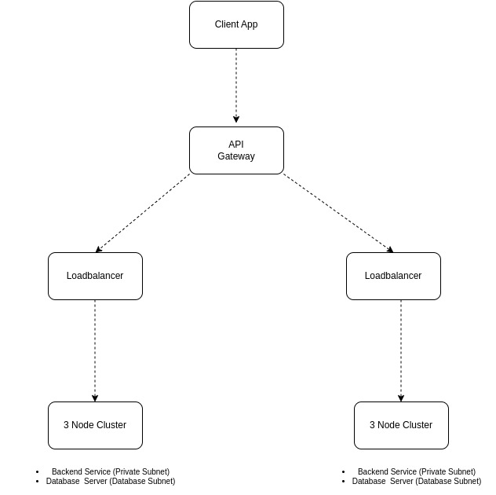

# danieldodoo-syself-devops

I created a HorizontalPodAutoscaler in helm charts to automatically scale workload per the average CPU and Memory utilization of target pods to match demand  

I recommend a Serverless Posgress Database instance to accomodate unpredictabled production workload and to scale with zero downtime in response to increased resource demand

## 3 Tier Layer Architecture Design:
The application is going to be hosted on a three-tier layer architecture and multi-region setup

Tier 1:  Client App
Tier 2:  Application Server
Tier 3:  Database Server

### 🛠️Infrastructure: 
The infrastructure will be deployed with Terraform (Iac) to provision required infrastructure resources to automate, avoid misconfiguration, and reproduce system configuration. 

- Virtual Network
- Virtual Machines
- Database Instance
- Loadbalancer
- API Gateway

### 💻Compute: 
3 nodes `8vCPU, 16 GB RAM`  will be provisioned, and the Kubernetes cluster will be bootstrapped with KubeAdm with `Ubuntu 24.04` as the base OS and `Kubernetes version v1.30.3`. 

- 1 Control-Plane Node
- 2 Worker Nodes

### 🚀Automated Workflows:
Argo CD is a declarative, GitOps continuous delivery tool for Kubernetes

GitHub Actions is a continuous integration and continuous delivery (CI/CD) platform to automate the build, test, and deployment pipeline

- GitOps framework to manage helm chart repository and automate deployment to Kubernetes cluster 

- A CI/CD Pipeline with Docker to build application code and push container image docker hub registry

**Tools: Terraform, Kubernetes, Helm, Docker, Github Actions, ArgoCD**
